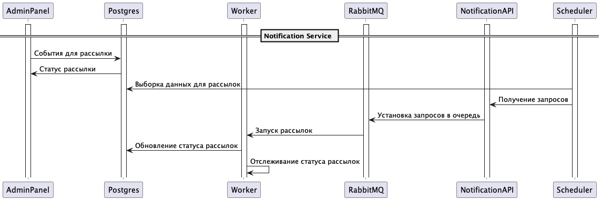
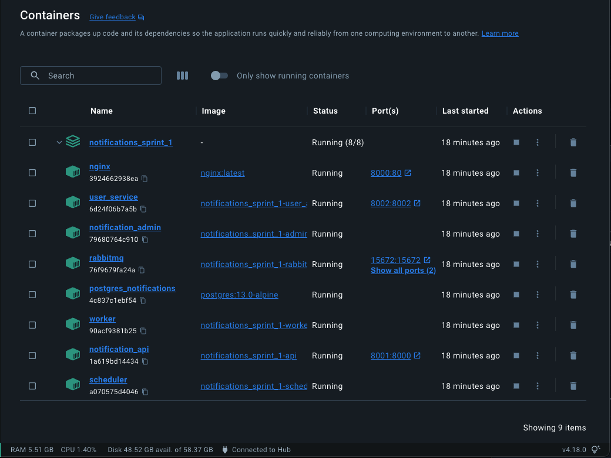
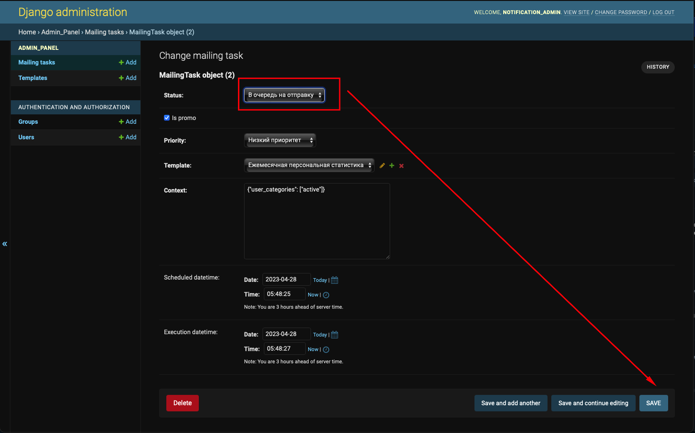
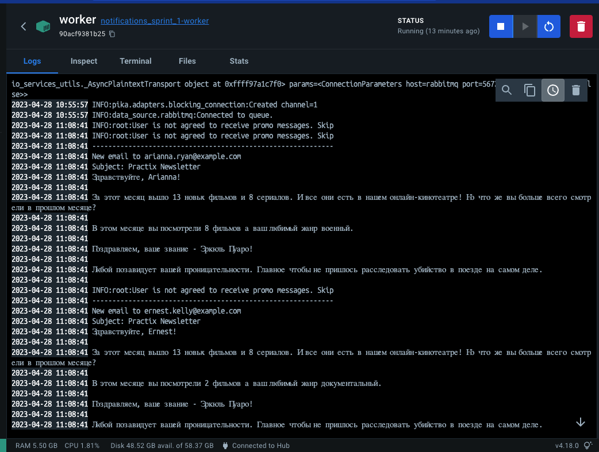

[](https://github.com/wemake-services/wemake-python-styleguide)
[](https://github.com/crank2303/notifications_sprint_1/actions)
[](https://pycqa.github.io/isort/)


# Проектная работа 10 спринта
Сервис для отправки уведомлений.

В границы проекта входят следующие подсистемы:
- Админка. Панель администрирования управления рассылками. ([Документация](services/app_admin/readme.md));
- Scheduler. Обработчик запуска заданий. ([Документация](services/scheduler/readme.md));
- API Notification. Точка входа для приема запросов на рассылку. ([Документация](services/notifications/readme.md));
- Worker. Обработчик заданий для рассылки уведомлений. ([Документация](services/worker/readme.md));
- User app. Тестовый сервис пользовательских данных. ([Документация](services/app_users/readme.md)).

## Схема и описание процессов


В админке создаются шаблоны и каналы рассылки. 

# Запуск проекта

Копируем файл с переменными окружения:
```sh
cd infra && cp .env.example .env
```

Сборка проекта:

```sh
docker-compose up --build
```

Статус контейнеров:


[Ссылка](http://localhost:8000/admin/) на админку и данные для авторизации:
```sh
login: notification_admin
password: ^Z0t&Upo&8&8
```

Запуск отправки писем

Переключить [задачу](http://127.0.0.1:8000/admin/admin_panel/mailingtask/2/change/) в состояние `В очередь на отправку`


Логи контейнера worker


## Notification API
Swagger: http://127.0.0.1:8001/docs#

Посылаем ивенты

Имитация работы воркера:
```json
{
  "event": {
    "is_promo": true,
    "priority": "low",
    "template_id": 3,
    "user_ids": [
      "894cd492-a3bc-424c-895f-1f2772074304",
      "6c88ad4d-a9f7-440f-ba22-45d00c41a072",
      "8509b63e-aceb-431f-9008-665ffff772d0",
      "581defac-e938-44f5-971a-00db5c4031df",
      "80fd41eb-9a85-4995-a127-9c12c7a2493f"
    ],
    "context": {}
  }
}
```
Имитация событий от AUTH
```json
{
    "user_id": "39275483-d542-400a-bb7c-6aefa15fbee6"
}
```
