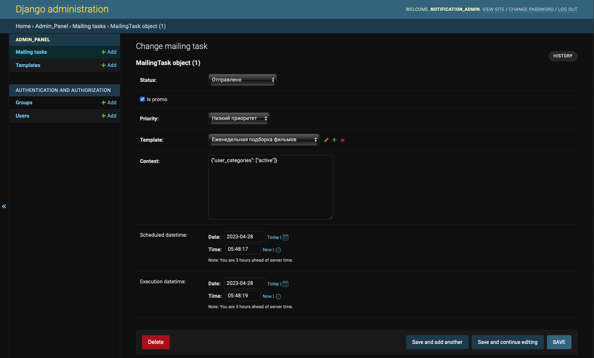

## Админка. Панель администрирования управления рассылками.

[Ссылка](http://localhost:8000/admin/) на админку и данные для авторизации:
```sh
login: notification_admin
password: ^Z0t&Upo&8&8
```

# Управления рассылками

- Создание шаблона для рассылки или выбор существующего;
- Создание заданий;
- Добавление шаблонов, контекста, списка и категорий пользователей;
- Установка приоритетов и времени отправки.

### Шаблон рассылки / уведомления

Шаблон привязан к типу транспорта для уведомления (это может быть sms, email, etc)


Например:

```json
[
  {
    "id": 1,
    "title": "welcome letter",
    "code": "welcome_letter",
    "template": "<!DOCTYPE html>\r\n<html lang=\"en\">\r\n<head>\r\n    <meta charset=\"UTF-8\">\r\n    <title>welcome letter</title>\r\n</head>\r\n<body>\r\n  <h1>Dear {{ username }}</h1>\r\n  <p>We are glad to welcome you to the website! </p>\r\n  <p>Verify your account by clicking on the link: {{ short_link }}</p>\r\n</body>\r\n</html>",
    "subject": "welcome letter",
    "transport": "email"
  },
  {
    "id": 3,
    "title": "security sms",
    "code": "security_notification",
    "template": "Hello, {{ context }}!\r\nYour password has been compromised",
    "subject": "Test email"
  }
]
```

### Задание рассылки



MailingTask имеет следующий вид:

```json
[
  {
    "id": 1,
    "status": "pending",
    "is_promo": true,
    "priority": "low",
    "context": "{\"films\": [\"380164b8-7503-4c15-b83d-88de95743880\", \"b0a67781-567c-407d-8c30-4f9d49325d88\", \"35936f0f-6aa5-4d03-afb3-a7e0ad099a66\"], \"user_ids\": [\"eba6db18-02ca-496a-ad70-f16fc876cd2a\", \"c15c61d0-1543-49b5-bfb9-c2743b3079e3\"], \"user_categories\": [\"active\"]}",
    "scheduled_datetime": "2022-02-01 18:00:00.000000 +00:00",
    "execution_datetime": null,
    "template_id": 2
  }
]
```

Мы можем выбрать приоритет для рассылки, способ рассылки, статический контент для одинаковых писем, выбрать является ли 
рассылка рекламной, выбрать время доставки письма пользователем.


### Расширяемость

Через модель админки:

```python
class Transport(models.TextChoices):
    sms = 'sms'
    email = 'email'
```

Через воркер рассылок:
```python
if event.transport == SMS:
    self.sms_sender.send(user_info.phone, item_to_send)
```

## Тестовые данные

Загрузить в базу

```shell
cd admin/src
python manage.py loaddata fixtures/admin_panel_data.json
```

Дамп из базы

```shell
cd admin/src
python manage.py dumpdata admin_panel > fixtures/admin_panel_data.json
```
