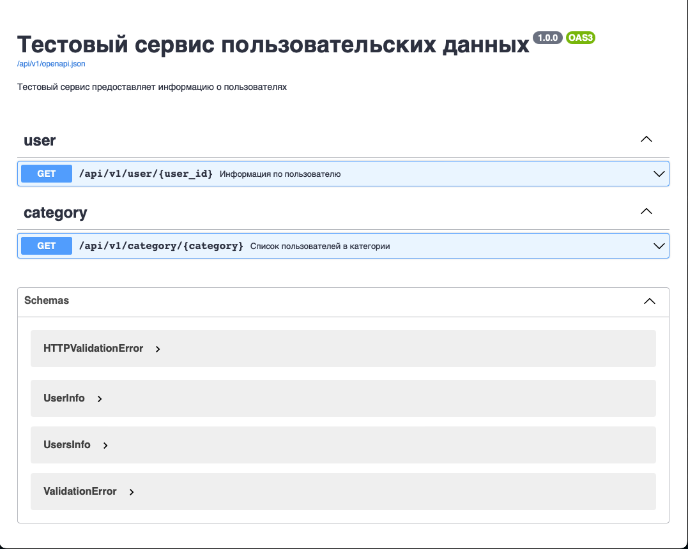

# User app. Тестовый сервис пользовательских данных.

Структура модели данных пользователей:

| Field             | Type | Description                                |
|-------------------|------|--------------------------------------------|
| id                | str  | ID пользователя                            |
| first_name        | str  | Имя                                        |
| last_name         | str  | Фамилия                                    |
| email             | str  | адрес почты                                |
| promo_agree       | bool | согласен ли он получать рекламную рассылку |
| category          | str  | категория, в которую входит пользователь   |
| films_month_count | int  | количество просмотренных фильмов за месяц  |
| favourite_genre   | str  | любимый жанр за последний месяц            |

## OpenAPI

[Ссылка](http://localhost:8002/api/v1/openapi) для доступа к openapi.


## Описание эндпоинтов

Информация по пользователю:
**api/v1/user/{user_id}**
```sh
http://localhost:8002/api/v1/user/f6b04881-c4e8-432e-9a32-ef21fc642b90
```

Пример ответа
```json
{
  "id": "f6b04881-c4e8-432e-9a32-ef21fc642b90",
  "first_name": "Sophie",
  "last_name": "Kelly",
  "email": "sophie.kelly@example.com",
  "promo_agree": false,
  "category": "active",
  "films_month_count": 7,
  "favourite_genre": "документальный"
}
```

Список пользователей в категории
**api/v1/category/{category}**
```sh
http://localhost:8002/api/v1/category/active
```

Пример ответа
```json
{
  "users": [
    {
      "id": "f6b04881-c4e8-432e-9a32-ef21fc642b90",
      "first_name": "Sophie",
      "last_name": "Kelly",
      "email": "sophie.kelly@example.com",
      "promo_agree": false,
      "category": "active",
      "films_month_count": 7,
      "favourite_genre": "документальный"
    },
    {
      "id": "02ba8560-d3c4-41c0-b3ef-daba1598459e",
      "first_name": "Morris",
      "last_name": "Sullivan",
      "email": "morris.sullivan@example.com",
      "promo_agree": true,
      "category": "active",
      "films_month_count": 1,
      "favourite_genre": "аниме"
    },
    ...
  ]
}
```
